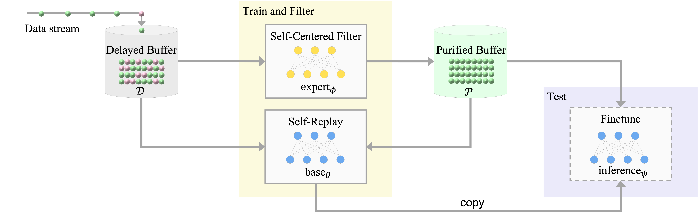

# Continual Learning on Noisy Data Streams via Self-Purified Replay
This repository contains the official PyTorch implementation for our ICCV2021 paper.
- [Chris Dongjoo Kim*](https://cdjkim.github.io/), [Jinseo Jeong*](https://www.jinseo.kr/), [Sangwoo Moon](https://vision.snu.ac.kr/people/sangwoomoon.html), [Gunhee Kim](https://vision.snu.ac.kr/gunhee/). Continual Learning on Noisy Data Streams via Self-Purified Replay. In ICCV, 2021 (* equal contribution).

[[Paper Link]](https://arxiv.org/abs/2110.07735)[[Slides]](resources/slides_full.pdf)[[Poster]](resources/poster.pdf)


# 

## System Dependencies
- Python >= 3.6.1
- CUDA >= 9.0 supported GPU

## Installation
Using virtual env is recommended.
```
$ conda create --name SPR python=3.6
```
Install pytorch==1.7.0 and torchvision==0.8.1.
Then, install the rest of the requirements.
```
$ pip install -r requirements.txt
```

## Data and Log directory set-up
create `checkpoints` and `data` directories.
We recommend symbolic links as below.
```
$ mkdir data
$ ln -s [MNIST Data Path] data/mnist
$ ln -s [CIFAR10 Data Path] data/cifar10
$ ln -s [CIFAR100 Data Path] data/cifar100
$ ln -s [Webvision Data Path] data/webvision

$ ln -s [log directory path] checkpoints
```

## Run
Specify parameters in `config` yaml, `episodes` yaml files.
```
python main.py --log-dir [log directory path] --c [config file path] --e [episode file path] --override "|" --random_seed [seed]

# e.g. to run mnist symmetric noise 40% experiment,
python main.py --log-dir [log directory path] --c configs/mnist_spr.yaml --e episodes/mnist-split_epc1_a.yaml --override "corruption_percent=0.4";

# e.g. to run cifar10 asymmetric noise 40% experiment,
python main.py --log-dir [log directory path] --c configs/cifar10_spr.yaml --e episodes/cifar10-split_epc1_asym_a.yaml --override "asymmetric_nosie=False|corruption_percent=0.4";

# e.g. to run cifar100 superclass symmetric noise 40% experiment,
python main.py --log-dir [log directory path] --c configs/cifar100_spr.yaml --e episodes/cifar100sup-split_epc1_a.yaml --override "superclass_nosie=True|corruption_percent=0.4";
```

## Expert Parallel Training
If you use slurm environment, training expert models in advance is possible.
```
# e.g. to run mnist symmetric noise 40% experiment,
python meta-main.py --log-dir [log directory path] -c configs/mnist_spr.yaml -e episodes/mnist-split_epc1_a.yaml --random_seed [seed] --override "corruption_percent=0.4" --njobs 10 --jobs_per_gpu 3

# also, you can only train experts for later use by adding an --expert_train_only option.
python meta-main.py --log-dir [log directory path] -c configs/mnist_spr.yaml -e episodes/mnist-split_epc1_a.yaml --random_seed [seed] --override "corruption_percent=0.4" --ngpu 10 --jobs_per_gpu 3 --expert_train_only

## to use the trained experts, set the same [log directory path] and [seed].
python main.py --log-dir [log directory path] --c configs/mnist_spr.yaml --e episodes/mnist-split_epc1_a.yaml --random_seed [seed] --override "corruption_percent=0.4";

```

## Citation
The code and dataset are free to use for academic purposes only. If you use any of the material in this repository as part of your work, we ask you to cite:
```
@inproceedings{kim-ICCV-2021,
    author    = {Chris Dongjoo Kim and Jinseo Jeong and Sangwoo Moon and Gunhee Kim},
    title     = "{Continual Learning on Noisy Data Streams via Self-Purified Replay}"
    booktitle = {ICCV},
    year      = 2021
}
```

Last edit: Oct 12, 2021

